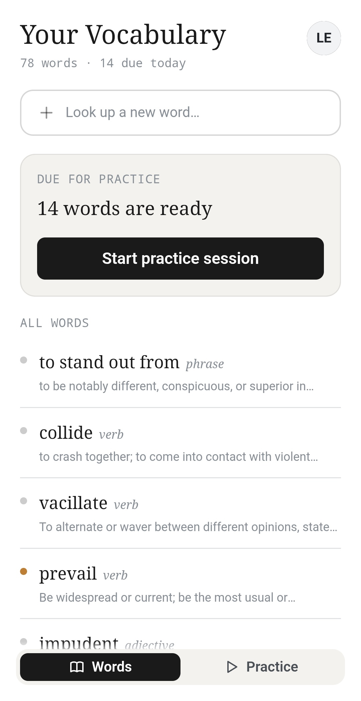
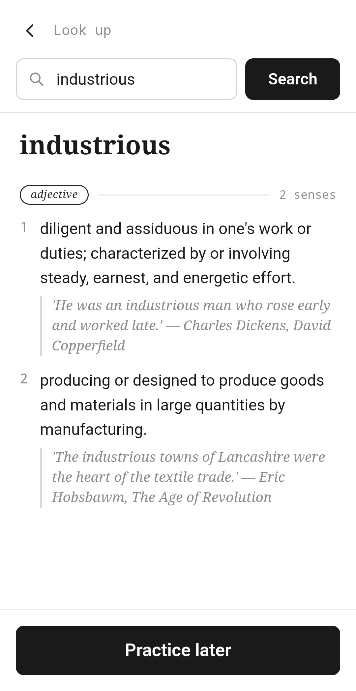
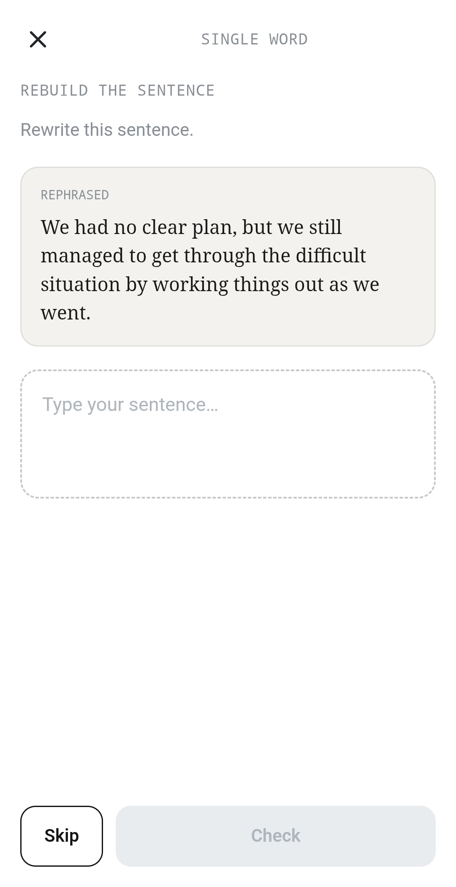

# smartify

**A quieter way to grow the words you actually use.**

[Live app](https://smartify-web-beige.vercel.app/) · [Landing page](https://smartify-landing.vercel.app/)

Look up a word, keep it, and practise it in short bursts — guess it from its definition, or
rebuild a sentence around it. One nudge a day, and the words you've saved stay open whether or
not you're signed in.

It's an installable PWA: a React Router SPA in front of Supabase Edge Functions, with Claude
doing the dictionary lookups, the example sentences, and the corrections.

## Screenshots

|                                                                  Your words                                                                   |                                                                          Look up a word                                                                           |                                                                        Rebuild a sentence                                                                         |
| :-------------------------------------------------------------------------------------------------------------------------------------------: | :---------------------------------------------------------------------------------------------------------------------------------------------------------------: | :---------------------------------------------------------------------------------------------------------------------------------------------------------------: |
|  |  |  |

## Features

- **Look up a word or phrase.** Senses grouped by part of speech, each with a definition and a
  real quoted example rather than every meaning at once. Misspellings are caught and returned
  as a suggestion — the dictionary never silently autocorrects what you typed.
- **Keep the ones worth keeping.** Anything you look up lands in your list with its
  definitions attached, newest first. Hit **Practice later** on the ones you fumbled and they
  earn two things: a one-tap **Marked** filter when you pick words to practise, and first place
  in the evening reminder.
- **Three practice modes.** Guess the word from its definition (with a hint if you stall),
  rebuild a sentence around it and get yours back with the corrections highlighted, or do both
  — a combined run does the guessing step for every word, then the sentence step.
- **Sentences that don't repeat.** Up to three sentences are cached per meaning and rotated
  least-used-first, so a word you practise often keeps giving you a different context. Haiku
  writes them; Sonnet picks up the ones Haiku can't.
- **One nudge a day.** 20:00 Europe/Berlin, five words, the marked ones first. The words stay
  out of the notification text — a lock screen is no place for vocabulary — and travel in the
  link instead, which opens the session already loaded.
- **Open by default, gated where it costs.** Reading your vocabulary needs no account. Every
  write and every model call verifies a signed-in user's token server-side.

## Tech stack

| Layer       |                                                                                                                                                               |
| ----------- | ------------------------------------------------------------------------------------------------------------------------------------------------------------- |
| **App**     | React 19 · React Router v7 (SPA, `ssr: false`) · TypeScript · Vite 8 · Mantine 9 · Tabler icons · Zustand · Dexie (IndexedDB) · Tailwind 4 (base layout only) |
| **Backend** | Supabase — Postgres + migrations, Auth, Edge Functions (Deno), Storage, `pg_cron`                                                                             |
| **AI**      | Anthropic Claude via `@anthropic-ai/sdk` — Haiku 4.5 by default, Sonnet 5 as the generation fallback, JSON-schema structured output                           |
| **PWA**     | Web app manifest · Workbox-generated service worker · Web Push + VAPID                                                                                        |
| **Landing** | Plain HTML + CSS on Vite — zero JavaScript shipped                                                                                                            |
| **Tooling** | npm workspaces · Vercel (each app deployed on its own)                                                                                                        |

## Repository layout

An npm-workspaces monorepo with two independent apps:

| Path           | What                                          | Dev                           | Build output            |
| -------------- | --------------------------------------------- | ----------------------------- | ----------------------- |
| `apps/web`     | the PWA — React Router v7 SPA                 | `npm run dev` (:5173)         | `apps/web/build/client` |
| `apps/landing` | the marketing page — static HTML + CSS, no JS | `npm run landing:dev` (:5174) | `apps/landing/dist`     |

`supabase/`, `scripts/`, `data/` and `.env` stay at the root and are shared; every command
below runs from the repo root.

## Getting started

```bash
npm install
npm run dev        # the app at http://localhost:5173
npm run typecheck
npm run build      # → apps/web/build/client (+ the service worker)
```

The landing page is a separate workspace on its own port — both can be up at the same time:

```bash
npm run landing:dev     # http://localhost:5174
npm run landing:build   # → apps/landing/dist
```
