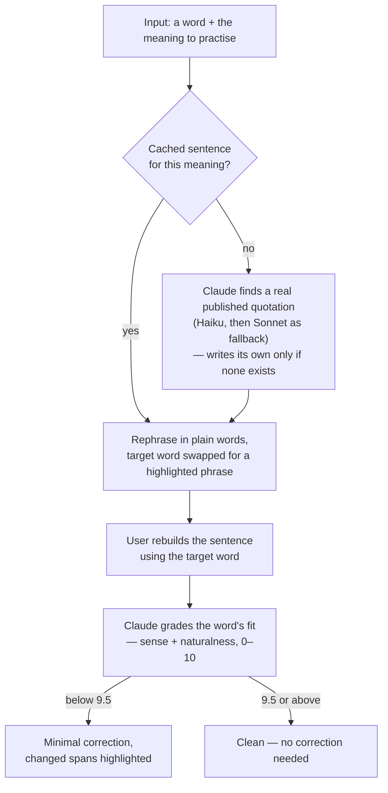

# smartify

**Learn English words by using them: look up, save, then rebuild real sentences with Claude grading the fit.**

[Live app](https://smartify-web-beige.vercel.app/)

## Why I built this

I consume a lot of information in English (reading books, watching video content) and I was
always fascinated by the diversity of this language. The variety of words and phrases which might
describe different things and the regional differences between the way the same thing might be
described were always interesting to me and caught my attention. So I built a small app to level
up my English by learning and practicing using those words and phrases the way it works for me.

## How it works

The core of the app is practising a new word or phrase by building a sentence with it, with the
help of Claude. The loop:



## Screenshots

|                                                                  Your words                                                                   |                                                                                 Look up a word                                                                                 |                                                                        Rebuild a sentence                                                                         |
| :-------------------------------------------------------------------------------------------------------------------------------------------: | :----------------------------------------------------------------------------------------------------------------------------------------------------------------------------: | :---------------------------------------------------------------------------------------------------------------------------------------------------------------: |
|  |  |  |

## Decisions & priorities

Some decisions I made along the way:

- **Vocabulary service:** I picked the Claude Haiku model instead of the Oxford API to look
  up new words. The goal here is to cut the cost of a single lookup. The alternative I checked —
  [Oxford Dictionaries pricing](https://account.oxforddictionaries.com/pricing) — costs £0.05 per
  call, while an average lookup using Haiku is around $0.01 at the moment of research. The
  potential deviation from the gold standard (the Oxford dictionary) is consciously accepted.
- **Platform:** I went with a PWA because I wanted to leverage push notifications for the
  reminders to practice, but I didn't want the overkill of developing a separate app and dealing
  with all the infrastructure (need to use Expo to build the app, etc.). The compromise here is
  not the smoothest UX and no proper native feeling, and this compromise was taken consciously as
  the target user (me) wouldn't spend a lot of time in the app.
- **Visuals:** to not spend too much time on coming up with a fresh design, I gave freedom to
  Claude Design, which came up with lean frames for core screens which served the purpose, and I
  iterated on the skeleton Claude built when fine-tuning the features.
- **The building process:** most of the time I spend goes into defining the goal and
  reviewing/iterating on the plan Claude Code came up with. After that, lots of time I spend on
  reviewing and fine-tuning the code changes. The app is still in MVP stage and has only 1 user
  (me), so I didn't invest time into covering it with tests thoroughly since the app and its
  behaviour change quite a lot. At the moment the focus is on getting value from the app and solving the problem
  now, rather than on perfect production readiness.
- **Cost control:** every function that calls Claude is gated behind its own
  mock-mode toggle, so the default path spends no tokens until I flip it on. Generation runs Haiku
  first and only falls back to Sonnet when Haiku can't produce a sentence. Results are cached to
  avoid repeat calls: a word you've already looked up is served from your saved vocabulary instead
  of a fresh lookup, and each meaning keeps up to three sentences, so
  practising a word again rarely triggers a fresh model call.

## Features

- **Look up a word or phrase.** Senses grouped by part of speech, each with a definition and a
  real quoted example rather than every meaning at once. Misspellings are caught and returned
  as a suggestion — the dictionary never silently autocorrects what you typed.
- **Keep the ones worth keeping.** Anything you look up lands in your list with its
  definitions attached, newest first. Hit **Practice later** on the ones you fumbled and they
  earn two things: a one-tap **Marked** filter when you pick words to practise, and first place
  in the evening reminder.
- **Three practice modes.** Guess the word from its definition (with a hint if you stall),
  rebuild a sentence around it and get yours back with the corrections highlighted, or do both
  — a combined run does the guessing step for every word, then the sentence step.
- **Sentences that don't repeat.** Up to three sentences are cached per meaning and rotated
  least-used-first, so a word you practise often keeps giving you a different context. Haiku
  writes them; Sonnet picks up the ones Haiku can't.
- **One nudge a day.** 20:00 Europe/Berlin, five words, the marked ones first. The words stay
  out of the notification text — a lock screen is no place for vocabulary — and travel in the
  link instead, which opens the session already loaded.
- **Open by default, gated where it costs.** Reading your vocabulary needs no account. Every
  write and every model call verifies a signed-in user's token server-side.

## Tech stack

| Layer       |                                                                                                                                                               |
| ----------- | ------------------------------------------------------------------------------------------------------------------------------------------------------------- |
| **App**     | React 19 · React Router v7 (SPA, `ssr: false`) · TypeScript · Vite 8 · Mantine 9 · Tabler icons · Zustand · Dexie (IndexedDB) · Tailwind 4 (base layout only) |
| **Backend** | Supabase — Postgres + migrations, Auth, Edge Functions (Deno), Storage, `pg_cron`                                                                             |
| **AI**      | Anthropic Claude via `@anthropic-ai/sdk` — Haiku 4.5 by default, Sonnet 5 as the generation fallback, JSON-schema structured output                           |
| **PWA**     | Web app manifest · Workbox-generated service worker · Web Push + VAPID                                                                                        |
| **Tooling** | npm workspaces · Vercel                                                                                                                                       |

## Repository layout

An npm-workspaces monorepo. The app lives in `apps/web`; `supabase/`, `scripts/`, `data/` and
`.env` stay at the root and are shared.

| Path       | What                          | Dev                   | Build output            |
| ---------- | ----------------------------- | --------------------- | ----------------------- |
| `apps/web` | the PWA — React Router v7 SPA | `npm run dev` (:5173) | `apps/web/build/client` |

Every command below runs from the repo root.

## Getting started

```bash
npm install
npm run dev        # the app at http://localhost:5173
npm run typecheck
npm run build      # → apps/web/build/client (+ the service worker)
```
