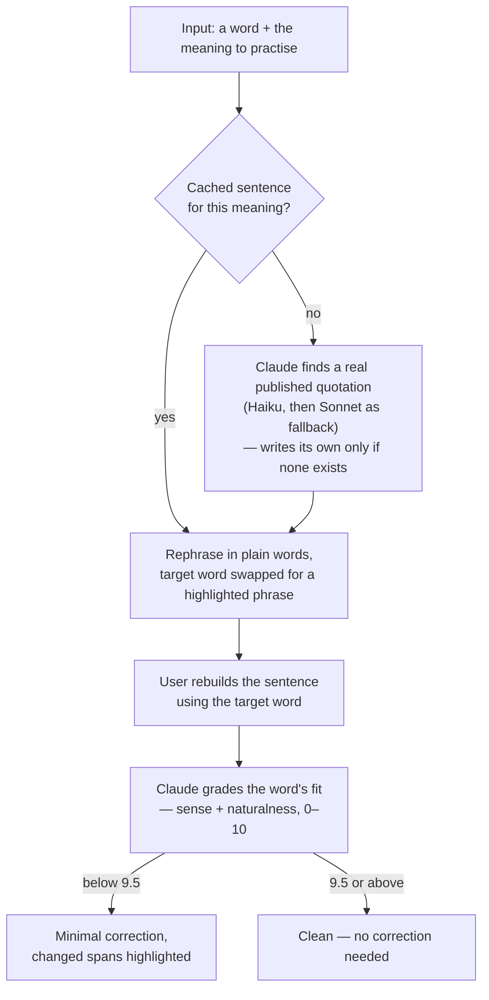

# smartify

[Live app](https://smartify-web-beige.vercel.app/)

## Short summary

The app is a PWA which allows you to look up and store new words and phrases in English. The user can practice the words by rebuilding sentences and using them in real context, while Claude provides the initial task and the context itself, and evaluates the result. The user gets daily push notification reminders about the practice.

## Screenshots

|                                                                  Your words                                                                   |                                                                                 Look up a word                                                                                 |                                                                        Rebuild a sentence                                                                         |
| :-------------------------------------------------------------------------------------------------------------------------------------------: | :----------------------------------------------------------------------------------------------------------------------------------------------------------------------------: | :---------------------------------------------------------------------------------------------------------------------------------------------------------------: |
|  |  |  |

*design was inspired and largely implemented by Claude Design

## List of features

- **Look up a word or phrase.** Different meanings are grouped by part of speech and are presented with examples. Misspellings are caught and each word/phrase is presented in its canonical form.
- **Keep the ones worth keeping.** Any word user wants to practice later can be marked by hitting the **Practice later** button. Such words are the ones selected for the daily practice reminders.
- **Three practice modes.** The user can simply try to guess a word by one of its meanings, rebuild a simplified sentence using the word or phrase selected for practice, or do both one after another in one go.
- **Real sentences for practice.** Up to three different sentences are cached per meaning and rotated
  least-used-first. Haiku searches for and generates them; Sonnet picks up where Haiku can't.
- **Real-world-like evaluation.** Claude is asked to evaluate the usage of the word or phrase with a focus on smoothness and naturalness, similar to how a native speaker would perceive it; proper usage in the context is weighed more than a 1-to-1 match with the original.
- **One reminder a day.** 20:00 Europe/Berlin, five words marked for practice. The push notification opens a practice session without revealing what is being practiced.
- **Auth-gated usage.** Anyone can see the default 5 words in the vocabulary and practice them by guessing. The rest of the app is auth-gated: only signed-in users can use the practice involving Claude and add new words. Any word a user adds is only visible to that user.

## Decisions & priorities

Some decisions I made along the way:

- **Vocabulary service:** I picked the Claude Haiku model instead of the Oxford API to look
  up new words. The goal here is to cut the cost of a single lookup. The alternative I checked —
  [Oxford Dictionaries API pricing](https://account.oxforddictionaries.com/pricing) — costs £0.05 per
  call, while an average lookup using Haiku is around $0.01 at the moment of research. The
  potential deviation from the gold standard (the Oxford dictionary) is consciously accepted.
- **Platform:** I went with a PWA because I wanted to leverage push notifications for the
  reminders to practice, but I didn't want the overkill of developing a separate app and dealing
  with all the infrastructure (need to use Expo to build the app, etc.). The compromise here is
  not the smoothest UX and no proper native feeling, and this compromise was taken consciously as
  the user is not expected to spend a lot of time in the app.
- **Visuals:** to not spend too much time on coming up with a fresh design, I gave freedom to
  Claude Design, which came up with lean frames for core screens which served the purpose, and I
  iterated on the skeleton Claude built when fine-tuning the features.
- **The building process:** most of my time goes into defining the goal and
  reviewing/iterating on the plan Claude Code came up with. After that, a lot of time goes into
  reviewing and fine-tuning the code changes. The app is still in the MVP stage and has only 1 user
  (me), so I didn't invest time into covering it with tests thoroughly since the app and its
  behaviour change quite a lot — what exists is a thin browser smoke suite over the critical paths,
  run in CI on every pull request, rather than broad coverage. At the moment the focus is on getting
  value from the app and solving the problem now, rather than on perfect production readiness.
- **Cost control:** generation runs Haiku first and only falls back to Sonnet when Haiku can't
  produce a sentence. Results are cached to avoid repeat calls: a word you've already looked up is
  served from your saved vocabulary instead of a fresh lookup, and each meaning keeps up to three
  sentences, so practising a word again rarely triggers a fresh model call.

## How practice sentences work

The core of the app is practising a new word or phrase by building a sentence with it, with the
help of Claude. The loop:



## Why I built this

I consume a lot of information in English (reading books, watching video content) and I was
always fascinated by the diversity of this language. The variety of words and phrases which might
describe different things and the regional differences between the way the same thing might be
expressed were always interesting to me and caught my attention. So I built a small app to level
up my English by learning and practicing using those words and phrases the way it works for me.

## Tech stack

| Layer       |                                                                                                                                                               |
| ----------- | ------------------------------------------------------------------------------------------------------------------------------------------------------------- |
| **App**     | React 19 · React Router v7 (SPA, `ssr: false`) · TypeScript · Vite 8 · Mantine 9 · Tabler icons · Zustand · Dexie (IndexedDB) · Tailwind 4 (base layout only) |
| **Backend** | Supabase — Postgres + migrations, Auth, Edge Functions (Deno), Storage, `pg_cron`                                                                             |
| **AI**      | Anthropic Claude via `@anthropic-ai/sdk` — Haiku 4.5 by default, Sonnet 5 as the generation fallback, JSON-schema structured output                           |
| **PWA**     | Web app manifest · Workbox-generated service worker · Web Push + VAPID                                                                                        |
| **Tooling** | Vercel · GitHub Actions CI · Storybook 10 · Vitest (browser mode) · Playwright · MSW                                                                          |

## Repository layout

A single app at the repository root, with its backend alongside it.

| Path                              | What                                                |
| --------------------------------- | --------------------------------------------------- |
| `app/`                            | the PWA — React Router v7 SPA (`npm run dev`, :5173) |
| `public/`                         | static assets, copied into `build/client`            |
| `.storybook/`                     | Storybook config, MSW handlers, fixtures             |
| `supabase/`                       | Postgres migrations + Deno edge functions            |
| `scripts/` `data/`                | seeding, migration, and build tooling                |

Every command below runs from the repo root; the build lands in `build/client`.

## Getting started

```bash
npm install
npm run dev        # the app at http://localhost:5173
npm run verify     # typecheck → lint → format → deno
npm run test       # Storybook stories in headless Chromium
npm run build      # → build/client (+ the service worker)
```
